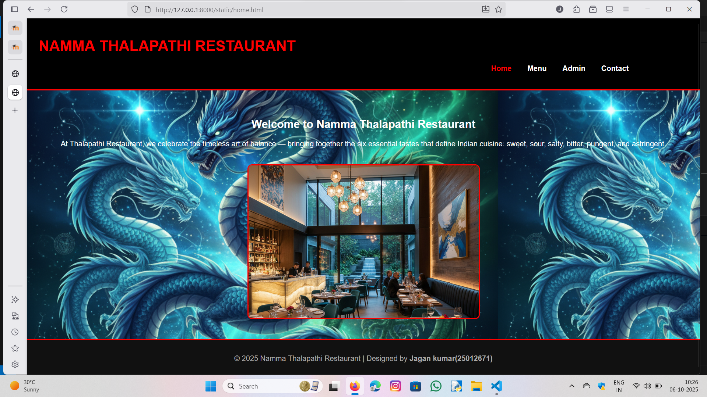
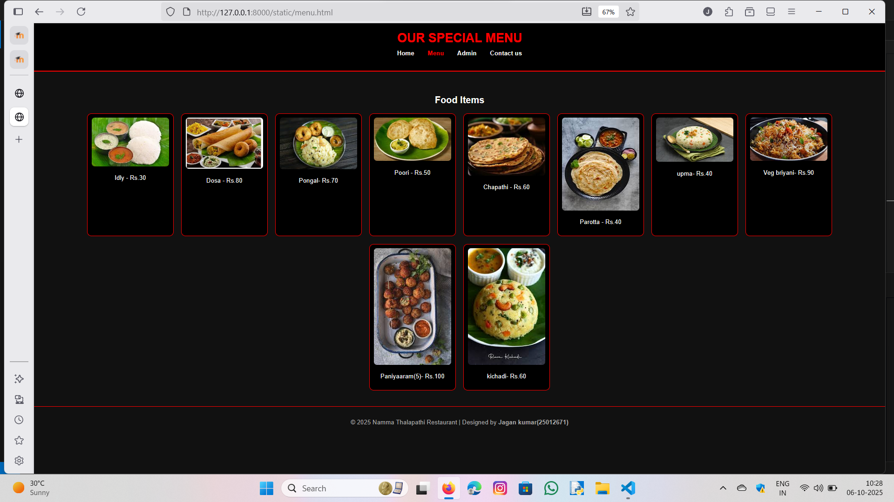
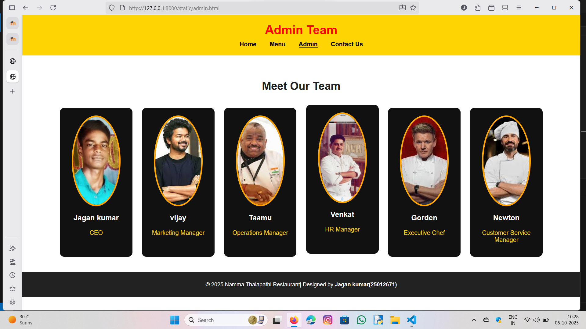
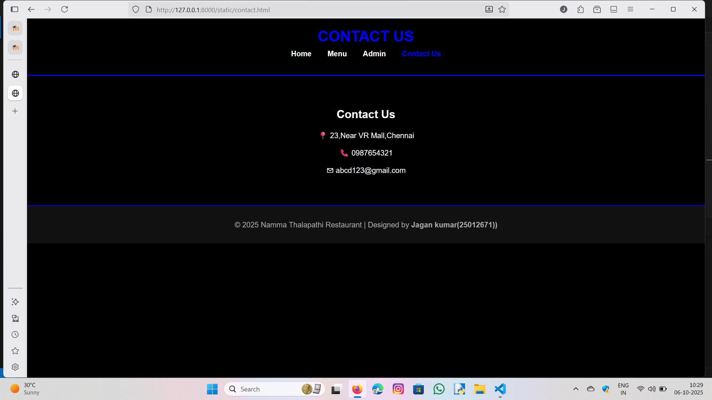

# Ex.07 Restaurant Website
## Date:06.10.2025

## AIM:
To develop a static Restaurant website to display the food items and services provided by them.

## DESIGN STEPS:

### Step 1:
Requirement collection.

### Step 2:
Creating the layout using HTML and CSS.

### Step 3:
Updating the sample content.

### Step 4:
Choose the appropriate style and color scheme.

### Step 5:
Validate the layout in various browsers.

### Step 6:
Validate the HTML code.

### Step 7:
Publish the website in the given URL.

## PROGRAM:
```
home.html

<!DOCTYPE html>
<html lang="en">
<head>
  <meta charset="UTF-8">
  <meta name="viewport" content="width=device-width, initial-scale=1.0">
  <title>Red Dragon Chinese Restaurant | Home</title>
  <link rel="stylesheet" href="home.css">
</head>
<body>
  <header>
    <h1>NAMMA THALAPATHI RESTAURANT</h1>
    
    <nav>
      <ul>
        <li><a href="index.html" class="active">Home</a></li>
        <li><a href="menu.html">Menu</a></li>
        <li><a href="admin.html">Admin</a></li>
        <li><a href="contact.html">Contact</a></li>
      </ul>
    </nav>
  </header>

  <section class="home">
    
    <h2></color>Welcome to Namma Thalapathi Restaurant</h2>
    <p>At Thalapathi Restaurant, we celebrate the timeless art of balance — bringing together the six essential tastes that define Indian cuisine: sweet, sour, salty, bitter, pungent, and astringent.</p>
    
  </section>

  <footer>
    <p>© 2025 Namma Thalapathi Restaurant | Designed by <strong>Jagan kumar(25012671)</strong></p>
  </footer>
</body>
</html>

home.css

body {
  background-image:url('dragon.png');
  font-family: Arial, sans-serif;
  background-color: white;
  color: white;
  margin: 0;
  text-align: center;
}

header {
  background-color: black;
  padding: 20px;
  border-bottom: 3px solid red;
}

h1 {
    position:relative;
  color: red;
  right:30%;
  top:20%;
}

nav ul {
  list-style: none;
  padding: 0;
  margin-top: 10px;
}

nav ul li {
  display: inline;
  margin: 0 15px;
}

nav a {
  color: white;
  text-decoration: none;
  font-weight: bold;
  position: relative;
  left:30%;
  
}

nav a.active,
nav a:hover {
  color: red;
  position: relative;
  left:30%;
}


.home {
  padding: 40px;
}

.home img {
  width: 500px;
  border-radius: 10px;
  margin-top: 20px;
  border: 3px solid red;
}

footer {
  background-color: #111;
  color: #aaa;
  padding: 15px;
  border-top: 2px solid red;
}

menu.html

<!DOCTYPE html>
<html lang="en">
<head>
  <meta charset="UTF-8">
  <meta name="viewport" content="width=device-width, initial-scale=1.0">
  <title>Menu | Ten Taste</title>
  <link rel="stylesheet" href="menu.css">
</head>
<body>
  <header>
    <h1>OUR SPECIAL MENU</h1>
    <nav>
      <ul>
        <li><a href="home.html">Home</a></li>
        <li><a href="menu.html" class="active">Menu</a></li>
        <li><a href="admin.html">Admin</a></li>
        <li><a href="contact.html">Contact us</a></li>
      </ul>
    </nav>
  </header>

  <section class="menu">
    <h2>Food Items</h2>
    <div class="menu-items">
      <div class="item"><p>Idly - Rs.30</p></div>
      <div class="item"><p>Dosa - Rs.80</p></div>
      <div class="item"><p>Pongal- Rs.70</p></div>
      <div class="item"><p>Poori - Rs.50</p></div>
      <div class="item"><p>Chapathi - Rs.60</p></div>
      <div class="item"><p>Parotta - Rs.40</p></div>
      <div class="item"><p>upma- Rs.40</p></div>
      <div class="item"><p>Veg briyani- Rs.90</p></div>
      <div class="item"><p>Paniyaaram(5)- Rs.100</p></div>
      <div class="item"><p>kichadi- Rs.60</p></div>
    </div>
  </section>

  <footer>
    <p>© 2025 Namma Thalapathi Restaurant | Designed by <strong>Jagan kumar(25012671)</strong></p>
  </footer>
</body>
</html>

menu.css

body {
  font-family: Arial, sans-serif;
  background-color: #111;
  color: white;
  margin: 0;
  text-align: center;
}

header {
  background-color: black;
  padding: 20px;
  border-bottom: 3px solid red;
}

h1 {
  color: red;
  margin: 0;
}

nav ul {
  list-style: none;
  padding: 0;
  margin-top: 10px;
}

nav ul li {
  display: inline;
  margin: 0 15px;
}

nav a {
  color: white;
  text-decoration: none;
  font-weight: bold;
}

nav a.active,
nav a:hover {
  color: red;
}

.menu {
  padding: 40px;
}

.menu-items {
  display: flex;
  justify-content: center;
  flex-wrap: wrap;
  gap: 20px;
}

.item {
  background-color: black;
  border: 2px solid red;
  border-radius: 10px;
  padding: 10px;
  width: 200px;
}

.item img {
  width: 100%;
  border-radius: 8px;
}

footer {
  background-color: #111;
  color: #aaa;
  padding: 15px;
  border-top: 2px solid red;
}

admin.html

<!DOCTYPE html>
<html lang="en">
<head>
    <meta charset="UTF-8">
    <meta name="viewport" content="width=device-width, initial-scale=1.0">
    <title>Admin Team</title>
    <link rel="stylesheet" href="admin.css">
</head>
<body>
    <header>
        <h1>Admin Team</h1>
        <nav>
            <ul>
                <li><a href="home.html">Home</a></li>
                <li><a href="menu.html">Menu</a></li>
                <li><a href="admin.html" class="active">Admin</a></li>
                <li><a href="contact.html">Contact Us</a></li>
            </ul>
        </nav>
    </header>

    <main>
        <h2>Meet Our Team</h2>

        <div class="team">
            <div class="member">
                
                <h3>Jagan kumar</h3>
                <p>CEO</p>
            </div>

            <div class="member">
                
                <h3>vijay</h3>
                <p>Marketing Manager</p>
            </div>

            <div class="member">
                
                <h3>Taamu</h3>
                <p>Operations Manager</p>
            </div>

            <div class="member">
                
                <h3>Venkat</h3>
                <p>HR Manager</p>
            </div>

            <div class="member">
                
                <h3>Gorden</h3>
                <p>Executive Chef</p>
            </div>

            <div class="member">
                
                <h3>Newton</h3>
                <p>Customer Service Manager</p>
            </div>
        </div>
    </main>

    <footer>
        <p>© 2025 Namma Thalapathi Restaurant| Designed by <strong>Jagan kumar(25012671)</strong></p>
    </footer>
</body>
</html>

admin.css

body {
    margin: 0;
    font-family: 'Poppins', sans-serif;
    background-color: #fff;
}

/* Header */
header {
    background-color: #FFD500;
    color: red;
    text-align: center;
    padding: 20px 0;
}

header h1 {
    margin: 0;
    font-size: 2em;
    font-weight: bold;
}

nav ul {
    list-style-type: none;
    padding: 0;
    margin: 10px 0 0;
}

nav ul li {
    display: inline;
    margin: 0 15px;
}

nav ul li a {
    text-decoration: none;
    color: black;
    font-weight: 600;
}

nav ul li a.active {
    text-decoration: underline;
}

/* Main Section */
main {
    text-align: center;
    padding: 40px 20px;
}

main h2 {
    color: #222;
    font-size: 1.8em;
    margin-bottom: 40px;
}

/* Team Cards */
.team {
    display: flex;
    flex-wrap: wrap;
    justify-content: center;
    gap: 25px;
}

.member {
    background-color: #111;
    color: white;
    border-radius: 12px;
    width: 150px;
    padding: 20px;
    transition: transform 0.3s;
}

.member:hover {
    transform: translateY(-8px);
}

.member img {
    width: 80%;
    height: 230px;
    object-fit: cover;
    border-radius: 50%;
    border: 4px solid orange;
}

.member h3 {
    margin-top: 15px;
    color: #fff;
    font-size: 1.2em;
}

.member p {
    color: #FFD500;
    font-weight: 500;
}

/* Footer */
footer {
    background-color: #222;
    color: white;
    text-align: center;
    padding: 10px;
    font-size: 0.9em;
}

contact.html

<!DOCTYPE html>
<html lang="en">
<head>
  <meta charset="UTF-8">
  <meta name="viewport" content="width=device-width, initial-scale=1.0">
  <title>Contact | Namma Thalapathi Restaurant</title>
  <link rel="stylesheet" href="contact.css">
</head>
<body>
  <header>
    <h1>CONTACT US</h1>
    <nav>
      <ul>
        <li><a href="home.html">Home</a></li>
        <li><a href="menu.html">Menu</a></li>
        <li><a href="admin.html">Admin</a></li>
        <li><a href="contact.html" class="active">Contact Us</a></li>
      </ul>
    </nav>
  </header>

  <section class="contact">
    <h2>Contact Us</h2>
    <p>📍 23,Near VR Mall,Chennai</p>
    <p>📞 0987654321</p>
    <p>✉ abcd123@gmail.com</p>
  </section>

  <footer>
    <p>© 2025 Namma Thalapathi Restaurant | Designed by <strong>Jagan kumar(25012671))</strong></p>
  </footer>
</body>
</html>

contact.css

body {
  font-family: Arial, sans-serif;
  background-color: black;
  color: white;
  margin: 0;
  text-align: center;
}

header {
  background-color: black;
  padding: 20px;
  border-bottom: 3px solid blue;
}

h1 {
  color: blue;
  margin: 0;
}

nav ul {
  list-style: none;
  padding: 0;
  margin-top: 10px;
}

nav ul li {
  display: inline;
  margin: 0 15px;
}

nav a {
  color: white;
  text-decoration: none;
  font-weight: bold;
}

nav a.active,
nav a:hover {
  color: blue;
}

.contact {
  padding: 50px;
}

footer {
  background-color: #111;
  color: #aaa;
  padding: 15px;
  border-top: 2px solid blue;
}

```

## OUTPUT:






## RESULT:
The program for designing software company website using HTML and CSS is completed successfully.
